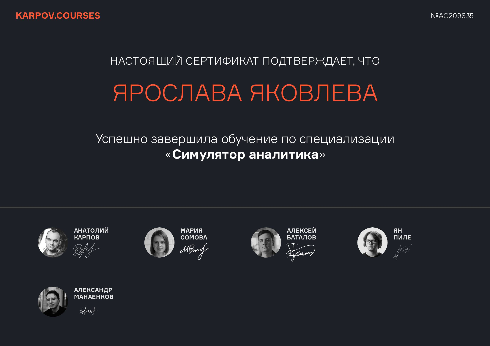
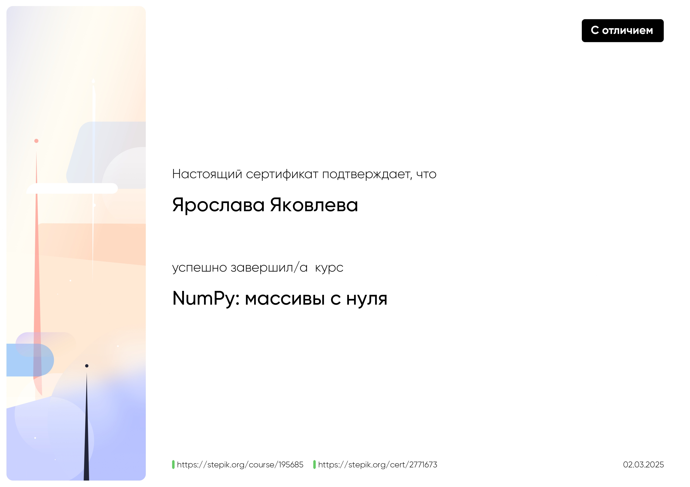

# Привет, я Ярослава! 👋

<h3 align="center">Нахожу эстетику в шуме данных ✨</h3>

 

Я — аналитик данных, который переводит хаос цифр на язык понятных историй и четких выводов. Мой путь в аналитику начался не с чистого листа, а с диплома по философии. Это научило меня главному: превращать туманные идеи в стройные системы и видеть за информацией — знание.

Сегодня я делаю то же самое, но мой исходный язык — это сырые данные.

*   💡 Мой **SQL-запрос** — это хорошо сформулированный философский вопрос к вселенной данных.
*   📈 Моя **data-визуализация** — это ясный и убедительный аргумент.
*   🧹 Моя работа с **«грязным» датасетом** — это герменевтика, искусство интерпретации.
 

## 🎓 Обучение

**«Симулятор аналитика» от Karpov.courses**

Это не просто курс, а концентрат опыта. Каждый модуль — это реальный кейс из практики IT-компаний. Я работала с продуктовыми метриками, проводила A/B-тесты, строила прогнозы и защищала свои выводы, как если бы это был мой рабочий проект.

 

 
 

### Другие сертификаты

<table align="center">
 <tr>
  <!-- Сертификат 1: Поколение Python -->
  <td align="center">
    
  </td>
  <!-- Сертификат 2: SQL -->
  <td align="center">
    
  </td>
 </tr>
 <tr>
  <!-- Сертификат 3: NumPy -->
  <td align="center">
    
  </td>
  <!-- Ячейка 4: можете оставить пустой или добавить еще один сертификат -->
  <td align="center">
    <!-- Сюда можно будет добавить четвертый сертификат в будущем -->
  </td>
 </tr>
</table>

## 📫 Как связаться со мной

  
  

